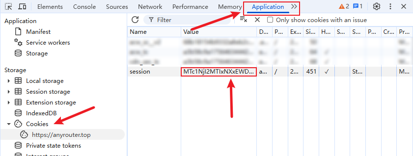
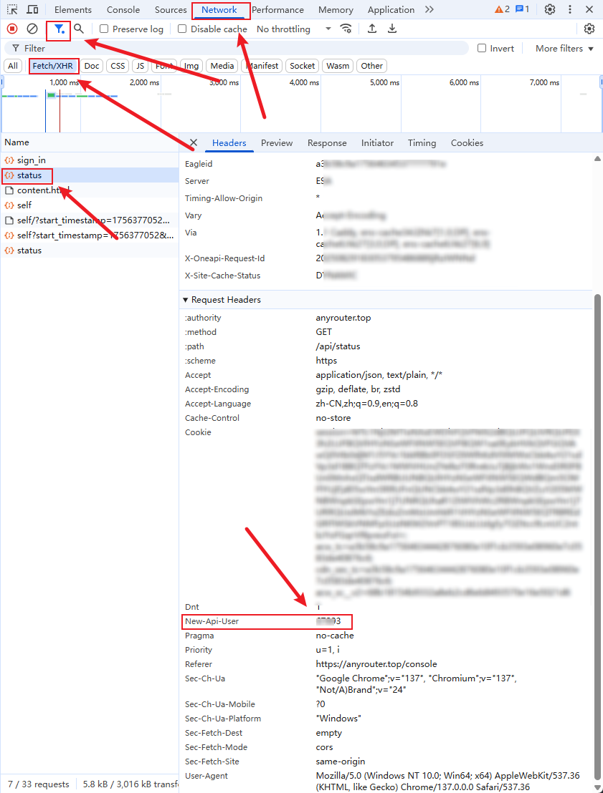
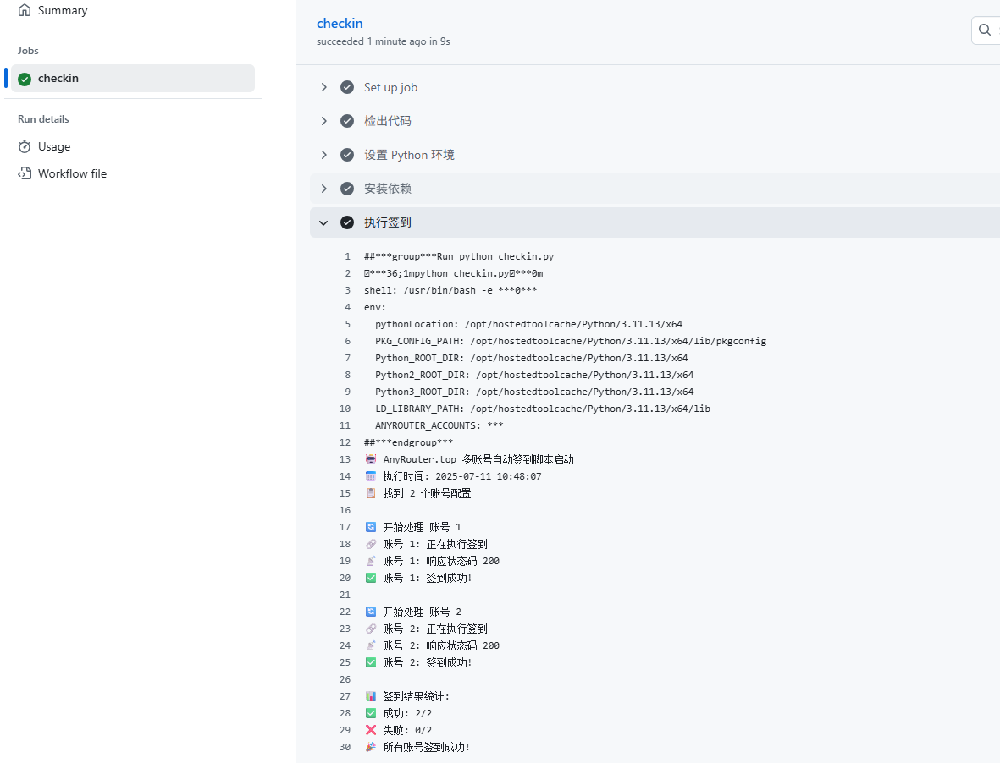

# AnyRouter Auto Check-in

Automated daily check-in for [AnyRouter.top](https://anyrouter.top/register?aff=gSsN) — a Claude Code proxy that gives $25 per daily check-in. Supports multi-account, automatic session renewal via GitHub OAuth, WAF bypass, and 6 notification channels.

Pair with [Auo](https://github.com/millylee/auo) for seamless Claude Code token switching.

## Features

- Multi-account daily check-in ($25/day per account)
- Automatic session renewal via GitHub OAuth (no manual cookie refresh)
- WAF bypass via headless Chromium
- Session persistence to Cloudflare KV
- Balance change detection with smart notifications
- 6 notification channels: Email, DingTalk, Feishu, WeCom, PushPlus, ServerChan

---

## How It Works

### High-Level Check-in Flow

```
                    +-----------------------+
                    |  Load account configs |
                    |  (env var or CF KV)   |
                    +-----------+-----------+
                                |
                    +-----------v-----------+
                    |  For each account:    |
                    +-----------+-----------+
                                |
                    +-----------v-----------+
                    |  Launch headless      |
                    |  Chromium, load       |
                    |  anyrouter.top/login  |
                    |  to obtain WAF cookies|
                    |  (acw_tc, cdn_sec_tc, |
                    |   acw_sc__v2)         |
                    +-----------+-----------+
                                |
                    +-----------v-----------+
                    |  Build HTTP client    |
                    |  with WAF cookies +   |
                    |  session cookie +     |
                    |  New-Api-User header  |
                    +-----------+-----------+
                                |
                    +-----------v-----------+
                    |  GET /api/user/self   |
                    |  (verify session)     |
                    +-----------+-----------+
                               / \
                    +---------+   +---------+
                    | 200 OK  |   | 401     |
                    +----+----+   +----+----+
                         |             |
                         |    +--------v--------+
                         |    | Has GitHub creds?|
                         |    +-------+---------+
                         |           / \
                         |    +-----+   +------+
                         |    | Yes |   | No   |
                         |    +--+--+   +--+---+
                         |       |         |
                         |  +----v----+    | FAIL
                         |  | GitHub  |    |
                         |  | OAuth   |<---+
                         |  | Login   |
                         |  | (below) |
                         |  +----+----+
                         |       |
                         |  +----v-----------+
                         |  | Rebuild client |
                         |  | with new       |
                         |  | session + WAF  |
                         |  +----+-----------+
                         |       |
                    +----v-------v----+
                    |  POST           |
                    |  /api/user/     |
                    |  sign_in        |
                    +---------+-------+
                              |
                    +---------v---------+
                    |  GET /api/user/   |
                    |  self (post       |
                    |  check-in balance)|
                    +---------+---------+
                              |
                    +---------v---------+
                    |  If session was   |
                    |  renewed, persist |
                    |  to Cloudflare KV |
                    +---------+---------+
                              |
                    +---------v---------+
                    |  Compare balance  |
                    |  hash, send       |
                    |  notifications    |
                    |  if changed/failed|
                    +-------------------+
```

### GitHub OAuth Session Acquisition (Detailed)

This is the core of automatic session renewal. When a session expires (HTTP 401), the program launches a full browser-based GitHub OAuth flow to obtain a fresh session cookie. This is necessary because anyrouter.top **only supports GitHub OAuth login** — there is no email/password option.

AnyRouter is built on [new-api](https://github.com/songquanpeng/one-api) (a fork of one-api). The OAuth flow is a **multi-party protocol** between the headless browser, the React SPA frontend, the new-api Go backend, and GitHub:

```
  Headless Browser              AnyRouter Frontend           AnyRouter Backend             GitHub
  (chromiumoxide)               (React SPA)                  (new-api / Go)               (OAuth Provider)
       |                              |                            |                           |
       |  1. GET /login               |                            |                           |
       |----------------------------->|                            |                           |
       |  (page loads, WAF cookies    |                            |                           |
       |   acw_tc/cdn_sec_tc/         |                            |                           |
       |   acw_sc__v2 are set by CDN) |                            |                           |
       |                              |                            |                           |
       |  2. fetch('/api/status')     |                            |                           |
       |----------------------------->|--------------------------->|                           |
       |  <-- { github_client_id }    |<--------------------------|                           |
       |                              |                            |                           |
       |  3. fetch('/api/oauth/state')|                            |                           |
       |----------------------------->|--------------------------->|                           |
       |                              |  Backend generates CSRF    |                           |
       |                              |  state, stores in gorilla/ |                           |
       |                              |  sessions server-side,     |                           |
       |  <-- { state: "abc123" }     |  sets initial `session`    |                           |
       |      + session cookie set    |  cookie on response        |                           |
       |                              |                            |                           |
       |  4. Navigate to GitHub OAuth URL                          |                           |
       |  GET /login/oauth/authorize?client_id={id}&state={state}&scope=user:email             |
       |----------------------------------------------------------------------------------------->|
       |                              |                            |                           |
       |  5. GitHub login page loads  |                            |                           |
       |  Fill #login_field (username)|                            |                           |
       |  Fill #password              |                            |                           |
       |  Click input[name='commit']  |                            |                           |
       |----------------------------------------------------------------------------------------->|
       |                              |                            |                           |
       |  6. GitHub 2FA page          |                            |                           |
       |  (defaults to passkey/WebAuthn prompt)                    |                           |
       |  Click "Use authenticator app" link                       |                           |
       |  to switch to TOTP input     |                            |                           |
       |                              |                            |                           |
       |  7. Generate TOTP code       |                            |                           |
       |  (RFC 6238 HMAC-SHA1,        |                            |                           |
       |   30-second time step)       |                            |                           |
       |  Fill TOTP input field       |                            |                           |
       |----------------------------------------------------------------------------------------->|
       |                              |                            |                           |
       |  8. (First-time only) GitHub shows OAuth authorization prompt                         |
       |  Click #js-oauth-authorize-btn to grant access            |                           |
       |----------------------------------------------------------------------------------------->|
       |                              |                            |                           |
       |  9. GitHub redirects to:     |                            |                           |
       |  anyrouter.top/oauth/github?code={code}&state={state}     |                           |
       |  (This is a FRONTEND route,  |                            |                           |
       |   NOT an API endpoint)       |                            |                           |
       |----------------------------->|                            |                           |
       |                              |                            |                           |
       |  10. React OAuth2Callback    |                            |                           |
       |  component mounts, extracts  |                            |                           |
       |  code & state from URL,      |                            |                           |
       |  makes AJAX call:            |                            |                           |
       |                              |  GET /api/oauth/github     |                           |
       |                              |  ?code={code}&state={state}|                           |
       |                              |--------------------------->|                           |
       |                              |                            |  Exchange code for token  |
       |                              |                            |-------------------------->|
       |                              |                            |  <-- access_token         |
       |                              |                            |                           |
       |                              |                            |  GET /user (GitHub API)   |
       |                              |                            |-------------------------->|
       |                              |                            |  <-- user profile + email |
       |                              |                            |                           |
       |                              |  Backend validates state   |                           |
       |                              |  against session, looks up |                           |
       |                              |  or creates user, calls    |                           |
       |                              |  setupLogin() which stores |                           |
       |                              |  {id, username, role,      |                           |
       |                              |   status, group} in the    |                           |
       |                              |  gorilla/sessions session  |                           |
       |                              |                            |                           |
       |                              |  <-- JSON {success, data:  |                           |
       |                              |       {username, role...}} |                           |
       |                              |  + updated session cookie  |                           |
       |                              |                            |                           |
       |  11. React stores user data  |                            |                           |
       |  in localStorage, navigates  |                            |                           |
       |  to /console/token           |                            |                           |
       |                              |                            |                           |
       |  Browser extracts:           |                            |                           |
       |  - session cookie (from      |                            |                           |
       |    browser cookie jar)       |                            |                           |
       |  - user_id (from             |                            |                           |
       |    localStorage.user.id)     |                            |                           |
       |  - WAF cookies (refreshed)   |                            |                           |
       |                              |                            |                           |
       v                              v                            v                           v
```

#### Key Technical Details

**Why browser automation?** AnyRouter's OAuth flow involves a React SPA that handles the callback client-side. The redirect from GitHub goes to a frontend route (`/oauth/github`), not an API endpoint. The React `OAuth2Callback` component extracts the `code` and `state` from the URL and makes the actual API call. This cannot be replicated with simple HTTP requests.

**WAF cookies**: AnyRouter uses CDN-level WAF protection that sets 3 required cookies (`acw_tc`, `cdn_sec_tc`, `acw_sc__v2`) via JavaScript challenge. These must be present on every API request or you get blocked.

**Session cookie format**: Go gorilla/sessions base64-encoded cookie (~440 chars, contains `|` characters). The standard `reqwest::cookie::Jar` doesn't reliably transmit these, so the program builds the `Cookie` header manually.

**Auth middleware requirements** (from new-api's `middleware/auth.go`):
1. Session must have `username` set (otherwise: 401 "未登录且未提供 access token")
2. `New-Api-User` header must be present and match the session's user ID
3. Both checks happen in sequence — session first, then header match

**GitHub 2FA handling**: GitHub now defaults to a passkey/WebAuthn prompt on the 2FA page. The program clicks the "Use authenticator app" link to switch to the TOTP input before entering the generated code.

**TOTP generation**: RFC 6238 compliant — HMAC-SHA1 with 30-second time step over the base32-decoded secret.

---

## Setup

### Option A: Manual Session (Simple)

Use this if you don't want auto-renewal. You'll need to manually refresh the session cookie when it expires (~1 month).

1. Log in to [anyrouter.top](https://anyrouter.top) via GitHub
2. Open DevTools (F12) → Application → Cookies → copy `session` value

   

3. Open DevTools → Network → filter Fetch/XHR → find the `New-Api-User` header value (5-digit number)

   

4. Configure your accounts (see [Account Configuration](#account-configuration))

### Option B: Auto-Renewal (Recommended)

The session auto-renews via GitHub OAuth when it expires. Requires:

- GitHub account credentials (username + password)
- TOTP secret (base32) for your GitHub 2FA authenticator app
- Cloudflare KV worker for session persistence (so renewed sessions survive across runs)

To get your TOTP secret: when setting up 2FA on GitHub, the setup page shows a QR code. The base32 secret is usually displayed as text below the QR code (e.g., `M5JK HZ2I KGON 2VOK`). Save this value.

---

## Account Configuration

### Format

```json
[
  {
    "name": "main account",
    "cookies": { "session": "your_session_value" },
    "api_user": "88888",
    "github_username": "your_github_username",
    "github_password": "your_github_password",
    "totp_secret": "YOUR_TOTP_SECRET_BASE32"
  }
]
```

| Field | Required | Description |
|-------|----------|-------------|
| `name` | No | Display name for logs and notifications. Defaults to `Account 1`, `Account 2`, etc. |
| `cookies.session` | Yes | Session cookie value. Can be empty string `""` if GitHub credentials are provided (will auto-login on first run). |
| `api_user` | Yes | The `New-Api-User` header value (5-digit user ID). Updated automatically after OAuth login. |
| `github_username` | No | GitHub username for auto-renewal. |
| `github_password` | No | GitHub password for auto-renewal. |
| `totp_secret` | No | Base32 TOTP secret for GitHub 2FA. Required if GitHub account has 2FA enabled. |

**Minimum config** (manual session only):
```json
[{ "cookies": { "session": "abc123" }, "api_user": "12345" }]
```

**Full config** (with auto-renewal):
```json
[{ "name": "main", "cookies": { "session": "" }, "api_user": "12345", "github_username": "user", "github_password": "pass", "totp_secret": "SECRET" }]
```

---

## Deployment

### GitHub Actions (Recommended)

1. **Fork** this repository
2. Go to **Settings** → **Environments** → **New environment** → name it `production`
3. Add environment secrets:

   | Secret | Required | Description |
   |--------|----------|-------------|
   | `ANYROUTER_ACCOUNTS` | Yes* | JSON array of account configs (see above) |
   | `AUTH_VALUE` | Yes* | Cloudflare KV auth value (for auto-renewal persistence) |

   \* If using Cloudflare KV, `ANYROUTER_ACCOUNTS` is read from KV instead. Set `AUTH_VALUE` to enable KV access.

4. Go to **Actions** → **AnyRouter 自动签到** → **Enable workflow**
5. Click **Run workflow** to test

The workflow runs every 6 hours via cron. GitHub Actions cron has ~1-1.5h delay; anyrouter.top check-in resets every 24h (not at midnight).



### Local Development

```bash
# Clone and build
git clone https://github.com/your-fork/anyrouter-check-in.git
cd anyrouter-check-in
cargo build --release

# Create .env from template
cp .env.example .env
# Edit .env with your account config

# Run
cargo run --release
```

The program auto-downloads and manages a headless Chromium browser via `chromiumoxide` — no manual ChromeDriver installation needed.

### Cloudflare KV Storage

When `AUTH_VALUE` is set and `ANYROUTER_ACCOUNTS` env var is absent, the program reads account configs from Cloudflare KV. After a session is renewed via OAuth, the updated session is written back to KV so subsequent runs use the fresh session.

KV API:
- **Read**: `GET /?key=anyrouter-accounts` with `x-auth: sha256(AUTH_VALUE)` header
- **Write**: `PUT /` with body `{"key": "anyrouter-accounts", "value": "<json-string>"}` and `x-auth` header

---

## Notifications

Notifications are sent when check-in fails or account balance changes. Configure via environment secrets:

| Channel | Environment Variables |
|---------|----------------------|
| Email | `EMAIL_USER`, `EMAIL_PASS`, `EMAIL_TO`, `CUSTOM_SMTP_SERVER` (optional) |
| DingTalk | `DINGDING_WEBHOOK` |
| Feishu | `FEISHU_WEBHOOK` |
| WeCom | `WEIXIN_WEBHOOK` |
| PushPlus | `PUSHPLUS_TOKEN` |
| ServerChan | `SERVERPUSHKEY` |

For webhook-based channels with keyword security (e.g., DingTalk), set the custom keyword to `AnyRouter`.

Each channel is independent — unconfigured channels are silently skipped.

---

## Troubleshooting

| Symptom | Cause | Fix |
|---------|-------|-----|
| HTTP 401 | Session expired | Add GitHub credentials for auto-renewal, or manually refresh session cookie |
| Missing WAF cookies | CDN challenge failed | The program retries automatically; check if anyrouter.top is accessible |
| TOTP input not found | GitHub changed 2FA page layout | Open an issue — the selector list may need updating |
| Error 1040 (08004) | AnyRouter's database overloaded | Transient server-side issue; retry later ([#7](https://github.com/millylee/anyrouter-check-in/issues/7)) |
| OAuth redirect fails | GitHub OAuth app config changed | Verify `github_client_id` returned by `/api/status` |
| All accounts log in as the same user | Browser profile shared across launches | Fixed — each browser now uses an isolated temp directory (see below) |

### Browser Profile Isolation (chromiumoxide quirk)

`chromiumoxide` 0.7, when no `user_data_dir` is specified, defaults to a **fixed** shared path (`/tmp/chromiumoxide-runner`). Every `Browser::launch()` reuses the same Chrome profile directory. This means GitHub session cookies from account 1's OAuth login persist into account 2's browser — GitHub auto-logs in with the wrong account, and all accounts end up with the same `user_id`.

The fix: each `Browser::launch()` is given a unique `user_data_dir` (timestamped temp path). The directory is cleaned up after `browser.close()`.

## Disclaimer

This script is for educational and research purposes only. Please ensure compliance with the relevant website's terms of service before use.
